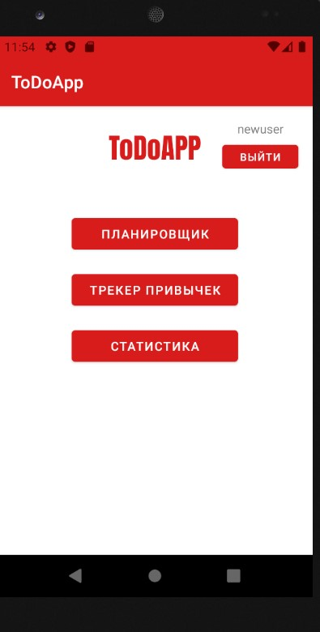
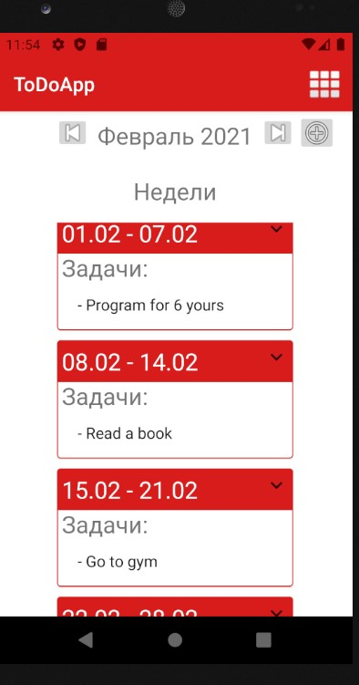
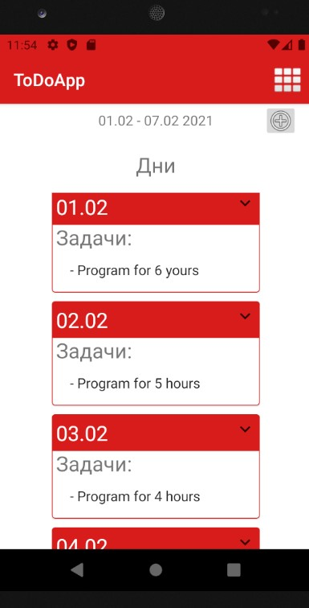
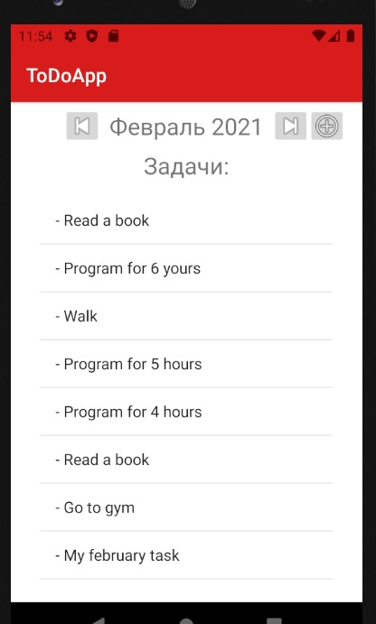
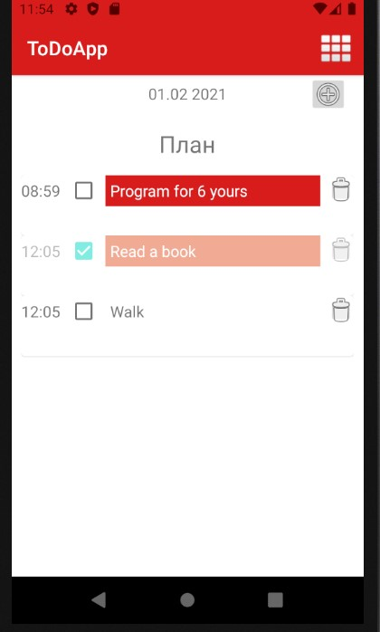
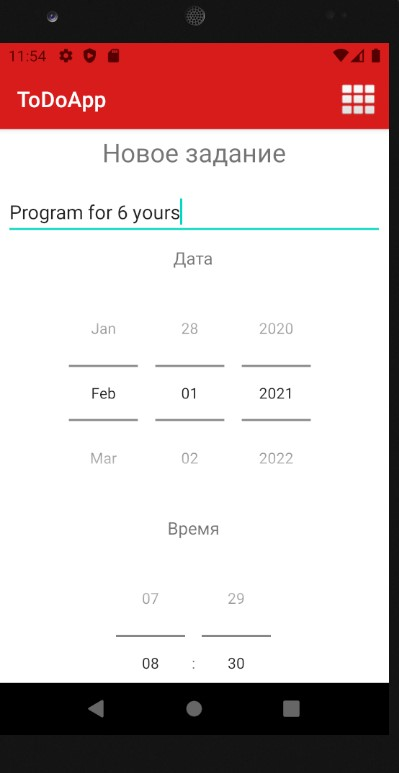

# ToDoApp

## Простое приложение на Android, симулирующая ежедневник

### Приложение включает в себя **планировщик**, **трекер привычек** и **статистику**.
### **Планировщик**

Планировщик разделяет месяц на недели и позволяет добавлять и просматривать задания. При добавлении задания можно выбрать название, дату, время и приоритет задачи. В зависимости от приоритета, будет меняться цвет фона задачи. Приложение использует Firebase для сохранения задач, а также для аутентификации пользователя.

*Главное меню приложения*

*Отображение месяца по неделям с превью задач*

*При открытии недели, она разбивается на 7 дней, на каждый из который можно нажать и перейти на страницу конкретного дня*

*Также можно просмотреть все задачи сразу для месяца и для недели.*

*При открытии страницы дня отображаются задачи, назначенные на этот день. Можно отметить выполнение задачи.*

*Страница добавления задачи*

#### В Крыму работает только с VPN
